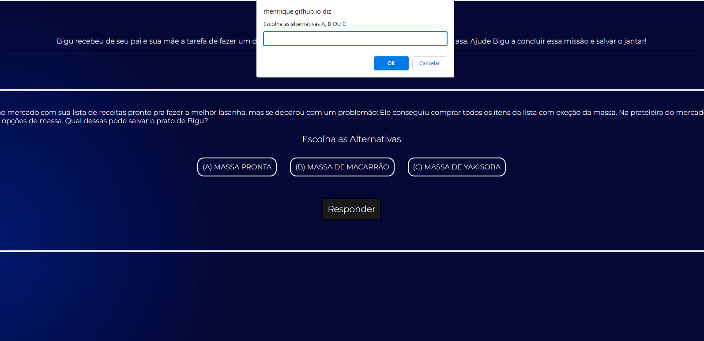

# Jogo das Escolhas
Um projeto bem simples que consiste em desenvolver um simples jogo utilizando as tecnologias **HTML, CSS e JavaScrip**.

### Mecanismos e forma de jogar
O jogo funciona de forma simples: existem 3 opções de pratos e você precisa escolher as alternativas corretas para chegar  
a vitória. Usa-se **prompts** de comando para selecionar as alternativas apresentandas em cada fase.

---

### Tecnologias usadas 
* HTML  
* CSS  
* Javascript 

---

Acesse o jogo clicando <a href="https://rhenriique.github.io/bigunacozinha/" target="_blank">aqui</a>.

